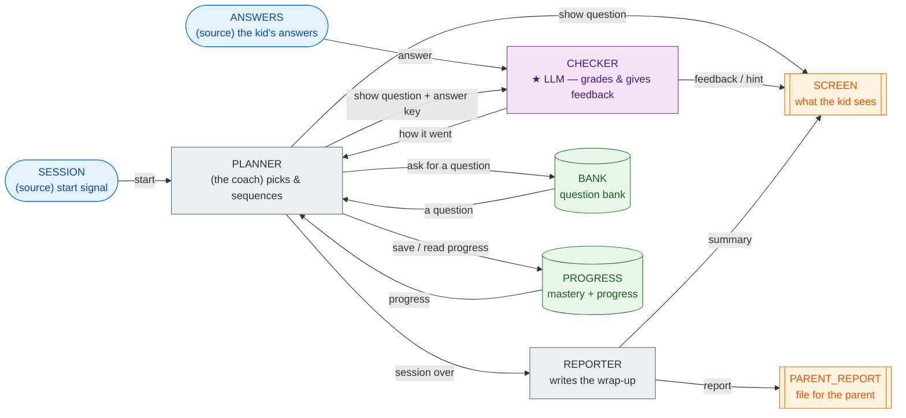

# OfficeSpeak

Build a running app as an **office** of cooperating **workers** — by describing
what you want in plain English, with no programming. This page walks through one
worked example: a fractions tutor for a single student. Later examples extend it
to many students, and to testing, debugging, and maintaining your system in
English. OfficeSpeak runs on the
[DisSysLab](https://github.com/kmchandy/DisSysLab) runtime.

---

## An office

An **office** is a small team of **workers** that pass messages to each other.
Each worker has **inboxes** (messages arrive) and **outboxes** (messages it
sends). An office has an org chart which is a set of **connections**. A
connection is from one outbox to one inbox. The office repeatedly takes a
message from the top of a nonempty outbox and places copies of the
message at the bottom of the inboxes to which it is connected. A connection is shown as
an arrow in diagrams.

---

## Step 0 — set up (once)

1. Get the two repos. OfficeSpeak uses the DisSysLab runtime as a dependency:

   ```bash
   git clone https://github.com/kmchandy/DisSysLab.git
   git clone https://github.com/kmchandy/OfficeSpeak.git
   ```

2. Open the **Claude desktop app**, turn on **Cowork**, and connect the folder
   that contains both `DisSysLab` and `OfficeSpeak` (drag it in / pick it when
   asked).
3. The LLM grader needs a Claude API key. Just paste your key into the chat and
   say *"save my Anthropic key so the tutor can use it"* — Claude will put it in
   the right place. (You can get a key at console.anthropic.com; ~2 minutes.)

---

## Step 1 — describe your app in English

This is an example of a description of an app.

1.1 **Paste the following into the chat in Cowork.**

> "I want an adaptive practice tutor for a kid learning fractions. It works from a
> bank of practice questions. It asks one question at a time on the screen and
> waits for an answer; if the answer is wrong it gives a gentle hint. It keeps
> track of how the kid is doing and, when the session ends, shows a short
> encouraging summary and saves a progress report the parent can read later."

1.2 Enter into chat: **"Build this office and explain it to me."**

**What you see back** — Claude shows a diagram of the org chart and
describes the team in English, something like:

Here is the diagram of the org chart for the tutor:



The colours mark the *kind* of each worker: blue = a **source** (feeds messages
in), grey = a plain **worker**, green = a **record** (a shared file with a
keeper), orange = a **sink** (an output), and the one **violet ★ box is the
language model**.

Three things the picture shows, which are the ideas behind every office:

- **PLANNER's inbox has several arrows into it** (from SESSION, BANK, PROGRESS,
  CHECKER). They all land in one inbox and PLANNER handles them one at a time.
- **BANK and PROGRESS are records** — shared files, each with a keeper agent.
- **The office stops itself** when everyone is done.


> *Meet the team.* A **coach** (PLANNER) decides what to ask and keeps the session
> moving. A **grader** (CHECKER) — this one is the language model — reads the kid's
> answer, decides if it's right, and writes the feedback. A **question bank**
> (BANK) holds the questions; a **progress keeper** (PROGRESS) remembers how the
> kid is doing. A **screen** shows the kid everything, and a **report file** saves
> a note for you.
>
> *The story of one question.* The coach pulls a question from the bank and shows
> it on the screen. The kid types an answer. The grader — the language model —
> checks it, writes a kind sentence of feedback, and tells the coach how it went.
> The coach updates progress and picks the next one. At the end, it puts an
> encouraging summary on the screen and saves your report.

---

## Step 2 — run it

Enter into the chat: **"Run the tutor and show me what the kid sees."**

Claude runs the office and shows the session. You get back something like this
(the questions and score are fixed; the **feedback wording is written fresh by
the model each run**, so yours will read a little differently):

```
=== tutor (LLM grader) — what the kid saw on SCREEN ===
  [SHOW]     1/2 + 1/2 = ?
  [FEEDBACK] Perfect! You're absolutely right — one half plus one half equals one whole!
  [SHOW]     1/4 + 1/4 = ?
  [FEEDBACK] Not quite — when you add 1/4 + 1/4 you get 2/4, which is the same as 1/2, not 1.
  [SHOW]     2/3 of 9 = ?
  [FEEDBACK] Perfect! Six is exactly right — great job finding 2/3 of 9!
  [SHOW]     3/4 - 1/4 = ?
  [FEEDBACK] Perfect! Two quarters is exactly the same as 1/2 — great job!

  [SUMMARY]  Session done — you got 3/4. Nice work!

=== parent report file ===
  {'kind': 'report', 'mastery': 3, 'questions_seen': 4, 'score': '3/4'}
```

Look at what the kid actually typed for those: **"one"**, **"1"**, **"six"**, and
**"two quarters"**. The grader is a language model and so it accepts *"one"* for 1.
It gives a hint on a mistake.

This run inside Cowork is a **demonstration**: the answers are fixed, so you can
watch the office work without typing. To let a real student type their own answers
live, see Step 4.

---

## Step 3 — change the office, in plain English

If the office that is generated does not do what you want it to do then
tell the chat what you want changed. For example:

- *"Add a question: 3 × 1/3 = ?, answer 1."*
- *"Give two hints before revealing the answer."*
- *"Make the summary mention which question was missed."*
- *"Pull the questions from this list I'm pasting in…"*


---

## Step 4 — let a real student try it (type answers live)

The run in Step 2 uses fixed answers so you can watch it. To let an actual
student sit down and type their own answers, run the **interactive** version in a
terminal (Cowork runs code without a live keyboard, so this one step happens in a
normal terminal on your machine — a one-time, two-line setup):

```bash
cd DisSysLab && pip install -e .          # once
cd ../OfficeSpeak/offices/phase2_demo
python tutor_interactive.py
```

The tutor shows a question, waits for the student to type an answer and press
Enter, the language model grades what they actually wrote, gives a line of
feedback, and moves on. At the end it prints an encouraging summary and saves the
parent report to `parent_report.json`. It's the same office as before — only the
answer feed and the screen are swapped for one live terminal.

---

## Later examples

1. Build an app that serves as a tutorial office that trains many students.
Keep track of each student and student cohorts. Send an alert to a
human tutor if a student gives random answers or stops answering.

2. Run an office in debug mode and then replay computations from global checkpoints.
   OfficeSpeak explains checkpoints and computations in English.

---

## Questions for you

1. Did the office that was constructed seem correct to you given the English
   description? Did the English explanations make sense?
2. Did you ask chat to modify the office? And did it do as you requested?

*(The runnable office is `offices/phase2_demo/tutor_llm.py`; the exact-match
version, if you want to compare, is `tutor.py`.)*
