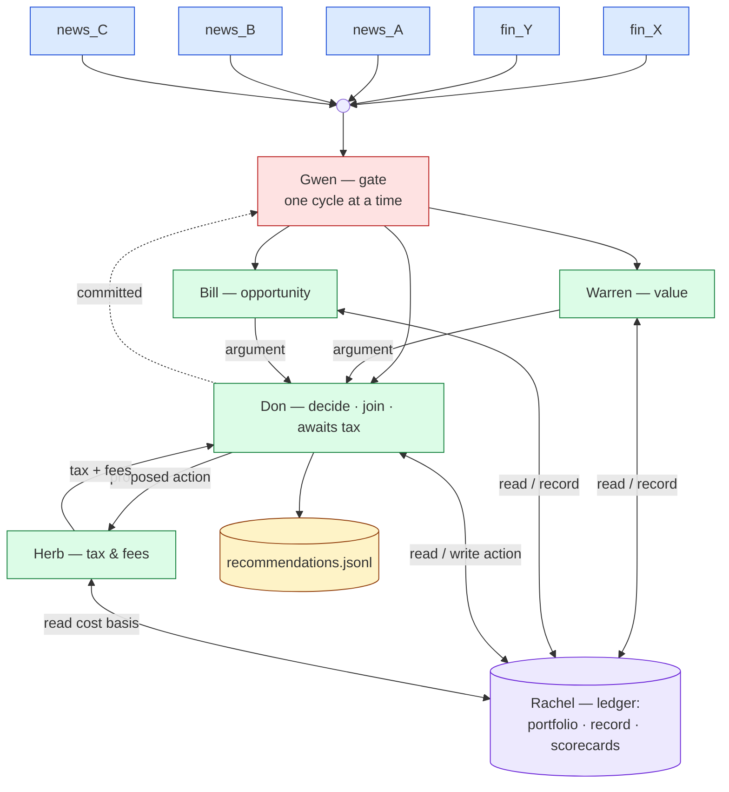

# investment_club — intended graph (ground truth for scoring)

Roster — each agent: role · state · reads · emits

- **Gwen — gate.** One decision cycle at a time; releases on Don's
  "committed".
- **Warren — value analyst.** State: value-strategy params + his own
  shadow portfolio. Reads: item; Rachel (record, real portfolio, his
  scorecard). Emits: value argument → Don; records argument → Rachel.
- **Bill — opportunity analyst.** Symmetric to Warren.
- **Don — decision maker · join · controlled merge.** State: decision
  policy (weights advisors by track record) + the real portfolio.
  Reads: item; Warren's + Bill's arguments (join for the same item);
  Herb's reply (state decides: awaiting-args vs awaiting-tax); Rachel
  (portfolio). Emits: proposed action → Herb; final action → Rachel
  (updates real portfolio + records it); recommendation → jsonl;
  "committed" → Gwen.
- **Herb — tax-and-fees analyst.** Reads: Don's proposed action; Rachel
  (cost basis). Emits: tax + fees → Don. (Don→Herb→Don is the one cycle.)
- **Rachel — record-keeper (the blackboard).** State: the real portfolio,
  the log of arguments and actions, and each agent's scorecard. Serves
  reads and applies writes; single agent, so access is serialized.
- Shadow portfolios: Warren, Bill, and Don each keep their own (local
  state, posted to Rachel so Don can compare track records).

The two things a reader must *infer* (and thus the likely Claude misses):
the shared ledger forces one-cycle-at-a-time serialization, and "try to
do better" means Don compares the shadow portfolios to reweight advisors.
