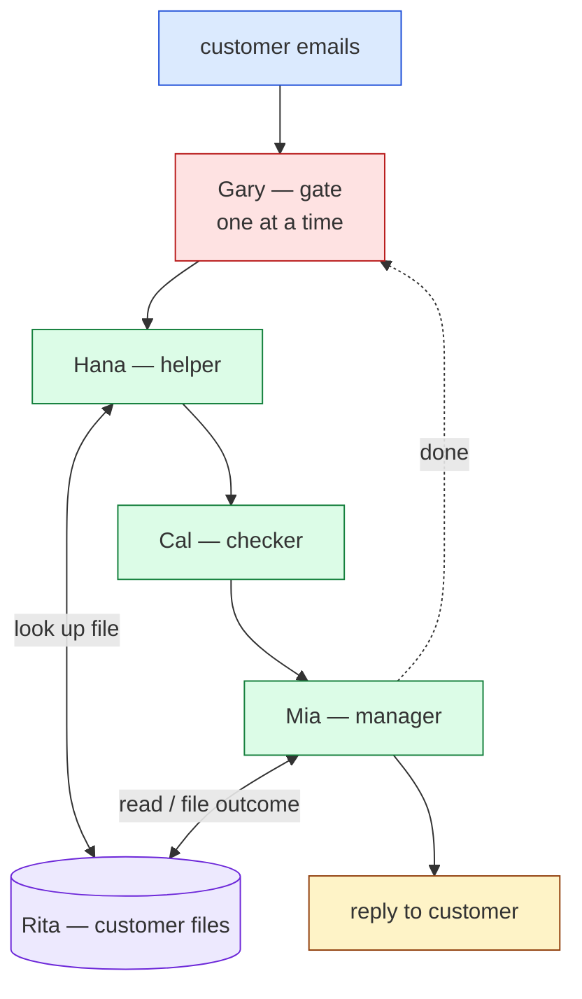

# support_desk — intended graph (ground truth)

Roster — each agent: role · state · reads · emits

- **Rita — record-keeper (the shared files).** State: one file per
  customer (orders, complaints, promises). Reads: look-up requests.
  Emits: the requested file; applies updates.
- **Gary — gate.** State: idle/busy. Admits one email at a time; releases
  when Mia has filed the outcome.
- **Hana — helper.** Reads: the email; the customer's file (from Rita).
  Emits: email + context → Cal.
- **Cal — checker.** Reads: email + context. Emits: email + context + a
  policy/promise flag → Mia.
- **Mia — manager.** Reads: email + context + flag; the customer's file.
  Emits: a reply → the customer; files the outcome → Rita; signals Gary.

Coordination: one email at a time (Gary), released by Mia's "done", so
reads/writes of the shared files are ordered → deterministic given the
email order.
