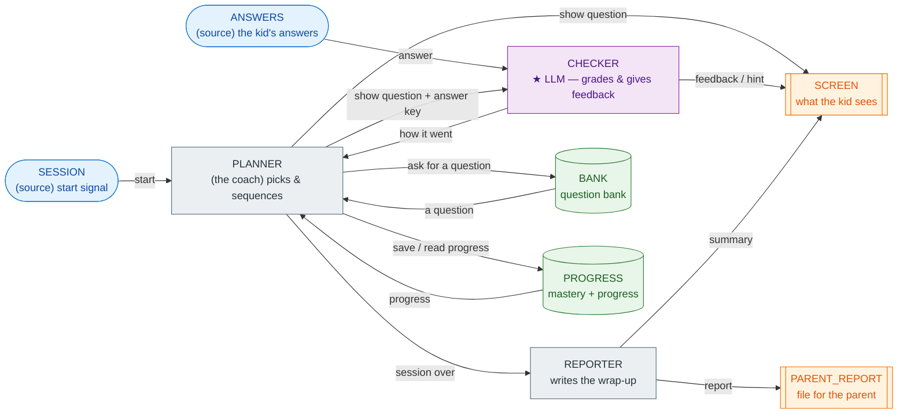

# OfficeSpeak — see the fractions tutor run (a first session for Sachin)

Hi Sachin,

This walks you from nothing to a running tutor with no setup beyond opening the
Claude desktop app. You don't install anything, you don't touch a terminal, and
you don't write code. You describe what you want in plain English and watch it
run. The example is a fractions tutor — the kind of thing you might want for your
daughter — and its "grader" is a language model, so it understands answers a kid
actually types.

Read the picture first, then do the three steps.

---

## The office at a glance

An **office** is a small team of **workers** that pass messages to each other.
Each worker has **inboxes** (messages arrive) and **outboxes** (messages it
sends); an arrow is a connection from one worker's outbox to another's inbox.
Here is the whole tutor:



The colours mark the *kind* of each worker: blue = a **source** (feeds messages
in), grey = a plain **worker**, green = a **record** (a shared file with a
keeper), orange = a **sink** (an output), and the one **violet ★ box is the
language model** — the only "smart" part. Everything else is fixed plumbing you
never write. The whole tutor rests on a single LLM worker with a job description:
*grade the answer and say something kind.*

Three things the picture shows, which are the ideas behind every office:

- **PLANNER's inbox has several arrows into it** (from SESSION, BANK, PROGRESS,
  CHECKER). They all land in one in-tray and PLANNER handles them one at a time —
  you never coordinate that.
- **BANK and PROGRESS are records** — shared files, each with a keeper. Because
  only PLANNER talks to each, they stay consistent with no locks.
- **The office stops itself** when everyone is done. There is no "run loop" to
  write or stop.

---

## What you do once: open Cowork, connect the folder

1. Open the **Claude desktop app** and turn on **Cowork**.
2. Connect the folder that has `DisSysLab` and `OfficeSpeak` (drag it in / pick
   it when asked).
3. The LLM grader needs a Claude API key. Just paste your key into the chat and
   say *"save my Anthropic key so the tutor can use it"* — Claude will put it in
   the right place. (No key yet? Get one at console.anthropic.com; ~2 minutes.)

That's all the setup there will ever be.

---

## Step 1 — describe the tutor

Paste this into the chat (this is the "Pat" describing what she wants):

> "I want an adaptive practice tutor for a kid learning fractions. It works from a
> bank of practice questions. It asks one question at a time on the screen and
> waits for an answer; if the answer is wrong it gives a gentle hint. It keeps
> track of how the kid is doing and, when the session ends, shows a short
> encouraging summary and saves a progress report the parent can read later."

Then say: **"Build me this office and explain it back to me."**

**What you see back** — Claude describes the team in plain English, something like:

> *Meet the team.* A **coach** (PLANNER) decides what to ask and keeps the session
> moving. A **grader** (CHECKER) — this one is the language model — reads the kid's
> answer, decides if it's right, and writes the feedback. A **question bank**
> (BANK) holds the questions; a **progress keeper** (PROGRESS) remembers how the
> kid is doing. A **screen** shows the kid everything, and a **report file** saves
> a note for you.
>
> *The story of one question.* The coach pulls a question from the bank and shows
> it on the screen. The kid types an answer. The grader — the language model —
> checks it, writes a kind sentence of feedback, and tells the coach how it went.
> The coach updates progress and picks the next one. At the end, it puts an
> encouraging summary on the screen and saves your report.

This is the loop we care about most: **the office is always explained back to you
in plain English**, so you can see whether it matches what you meant before it
runs. It also shows you the diagram above.

---

## Step 2 — run it and watch

Say: **"Run the tutor and show me what the kid sees."**

Claude runs the office and shows the session. You get back something like this
(the questions and score are fixed; the **feedback wording is written fresh by
the model each run**, so yours will read a little differently):

```
=== tutor (LLM grader) — what the kid saw on SCREEN ===
  [SHOW]     1/2 + 1/2 = ?
  [FEEDBACK] Perfect! You're absolutely right — one half plus one half equals one whole!
  [SHOW]     1/4 + 1/4 = ?
  [FEEDBACK] Not quite — when you add 1/4 + 1/4 you get 2/4, which is the same as 1/2, not 1.
  [SHOW]     2/3 of 9 = ?
  [FEEDBACK] Perfect! Six is exactly right — great job finding 2/3 of 9!
  [SHOW]     3/4 - 1/4 = ?
  [FEEDBACK] Perfect! Two quarters is exactly the same as 1/2 — great job!

  [SUMMARY]  Session done — you got 3/4. Nice work!

=== parent report file ===
  {'kind': 'report', 'mastery': 3, 'questions_seen': 4, 'score': '3/4'}
```

Look at what the kid actually typed for those: **"one"**, **"1"**, **"six"**, and
**"two quarters"**. A grader that just compared strings would mark three of the
four wrong. Because the grader is a language model, it accepts *"one"* for 1, and
*"two quarters"* for 1/2, and it gives a genuine hint on the one real mistake —
all from the single job description in the violet box. That is the whole point:
**the thinking part is the model; you didn't write any grading rules.**

---

## Step 3 — change it, in plain English

Everything is changeable by asking. Try any of these and Claude rebuilds and
reruns the office:

- *"Add a question: 3 × 1/3 = ?, answer 1."*
- *"Give two hints before revealing the answer."*
- *"Make the summary mention which question was missed."*
- *"Pull the questions from this list I'm pasting in…"*

You describe the change; the wiring above doesn't change; the office runs again.
When something doesn't match what you had in mind, say so — that back-and-forth is
exactly what we're hoping you'll push on.

---

## Why there's no Python here

The base case is the language model. The worker that makes a *judgement* — is this
answer right, what should we tell the kid — is an LLM given a short job
description, and it plugs into the office like any other worker. The rest (the
screen, the answer feed, the saved report, the question bank, the progress file,
and the coach's simple "ask, wait, next" sequencing) is fixed plumbing that comes
with OfficeSpeak. You never see it as code to write.

There is one good reason to bring plain code *back* later, and it's a nice next
step: a small **watcher** worker that counts wrong answers and, if the kid misses
too many in a row, **alerts you**. That's a rule you'd want to be exact and
auditable — "3 misses → message the parent" — not a judgement call, so it's a
perfect job for a tiny code worker rather than the model. We can add it to this
same diagram in one step whenever you like.

---

## What would help us most

1. Reading the diagram and the explain-back cold — was it clear what the tutor is
   and how the pieces fit, before you ran anything?
2. The run itself — did "describe it, then watch it" feel frictionless, or did you
   hit anything that made you stop?
3. The LLM grader accepting "one" and "two quarters" — did that land as obviously
   useful for a real kid?
4. A change you asked for in Step 3 — did the result match what you meant?

Rough notes are perfect. And if any office ever hangs instead of stopping, tell us
right away — that's a bug we want. Thanks for trying it, Sachin.

*(The runnable office is `offices/phase2_demo/tutor_llm.py`; the exact-match
version, if you want to compare, is `tutor.py`.)*
